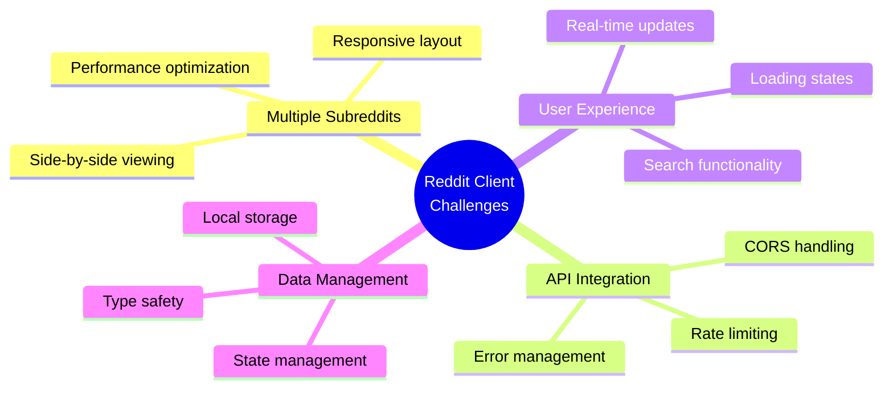
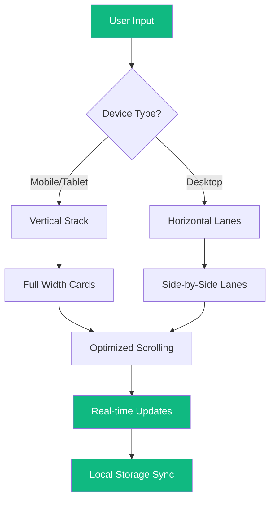
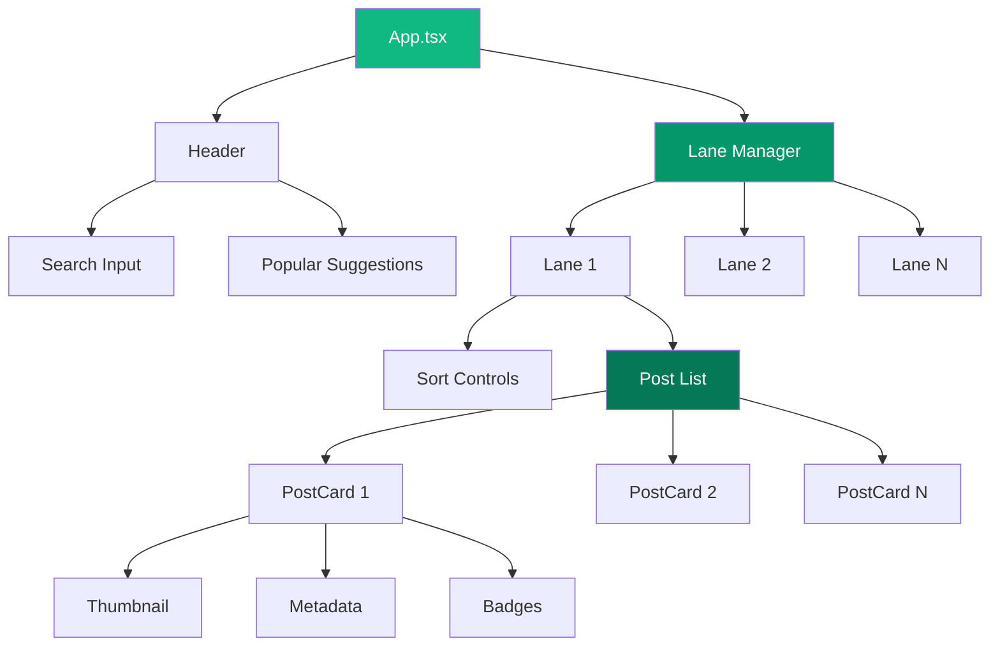
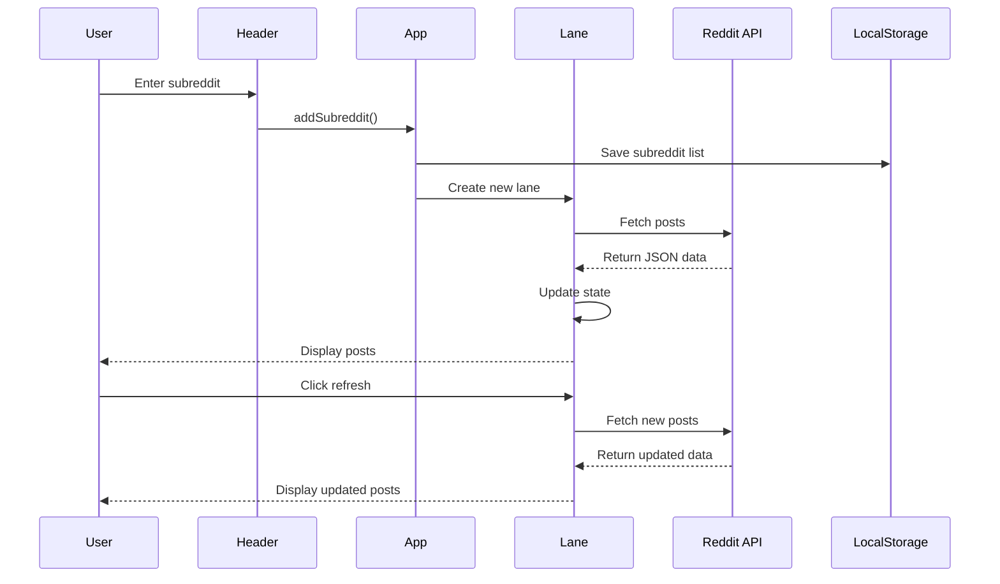
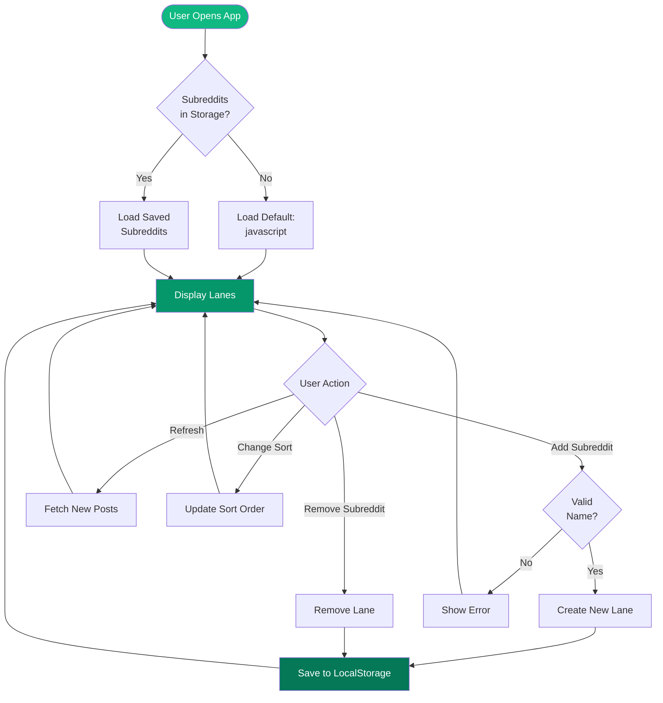
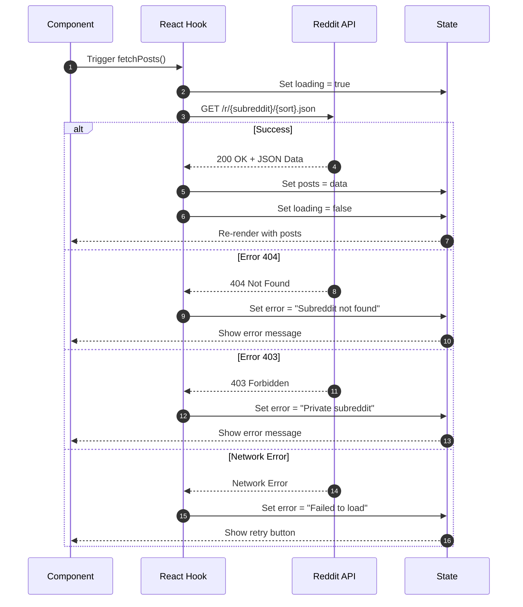
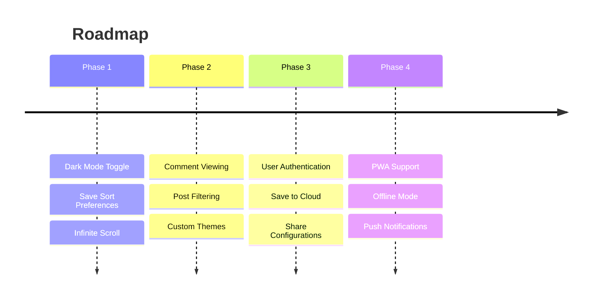

<div align="center">

<!-- Colorful Wave Header -->


<br/>

<!-- Project Logo -->


<h1>🚀 Reddit Multi-Viewer</h1>

<p align="center">
  <strong>A modern, responsive web application to browse multiple subreddits side-by-side in real-time</strong>
</p>

<!-- Badges -->
<p align="center">
  
  
  
  
</p>

<p align="center">
  <a href="#-features">Features</a> •
  <a href="#-problem-statement">Problem</a> •
  <a href="#-solution">Solution</a> •
  <a href="#-demo">Demo</a> •
  <a href="#-installation">Installation</a> •
  <a href="#-usage">Usage</a>
</p>

<br/>

<!-- Problem Statement Link -->
<a href="https://roadmap.sh/projects/reddit-client">
  
</a>

</div>

---

## 📋 Table of Contents

- [✨ Features](#-features)
- [🎯 Problem Statement](#-problem-statement)
- [💡 Solution](#-solution)
- [🏗️ Architecture](#️-architecture)
- [🛠️ Tech Stack](#️-tech-stack)
- [📊 System Flow](#-system-flow)
- [🚀 Installation](#-installation)
- [💻 Usage](#-usage)
- [📸 Screenshots](#-screenshots)
- [🗂️ Project Structure](#️-project-structure)
- [🔮 Future Enhancements](#-future-enhancements)
- [🤝 Contributing](#-contributing)
- [📄 License](#-license)

---

## ✨ Features

<div align="center">

| Feature | Description |
|---------|-------------|
| 🎨 **Modern UI** | Clean white theme with elegant green accents |
| 📱 **Fully Responsive** | Optimized for mobile, tablet, and desktop |
| 🔄 **Real-time Updates** | Refresh button with loading states |
| 🎯 **Multi-Lane View** | Browse multiple subreddits simultaneously |
| 🔍 **Smart Search** | Quick suggestions with popular subreddits |
| 📊 **Multiple Sorting** | Hot, New, and Top post sorting |
| 💾 **Local Storage** | Persists your subreddit preferences |
| ⚡ **Fast Loading** | Optimized performance with React hooks |
| 🎭 **Rich Post Cards** | Thumbnails, badges, flairs, and metadata |
| ⌨️ **Keyboard Shortcuts** | Enter to add, Esc to clear |

</div>

---

## 🎯 Problem Statement

<div align="center">

</div>

### 📌 Original Challenge

Build a Reddit client application that allows users to browse posts from multiple subreddits. The application should use the Reddit JSON API to fetch posts and display them in a user-friendly interface.

**Source:** [roadmap.sh/projects/reddit-client](https://roadmap.sh/projects/reddit-client)

### 🚨 Key Challenges


### 💭 Core Problems to Solve

1. **Multi-Column Layout**: How to display multiple subreddits simultaneously on different screen sizes?
2. **API Limitations**: Reddit's JSON API doesn't support authentication but has rate limits
3. **State Management**: Managing multiple async data sources efficiently
4. **Responsive Design**: Providing optimal UX across mobile, tablet, and desktop
5. **Performance**: Loading and rendering multiple feeds without lag
6. **Type Safety**: Ensuring robust TypeScript types for Reddit's complex data structure

---

## 💡 Solution

### 🎨 Design Approach

Our solution implements a **clean, modern, multi-lane interface** with the following innovations:


### 🔧 Technical Solutions

| Problem | Solution | Implementation |
|---------|----------|----------------|
| **Multiple Lanes** | Responsive Grid System | CSS Grid for mobile, Flexbox for desktop |
| **API Fetching** | Custom React Hooks | `useEffect` + `useCallback` for optimization |
| **State Management** | Local Storage Hook | Custom `useLocalStorage` hook with persistence |
| **Type Safety** | TypeScript Interfaces | Comprehensive Reddit API types |
| **Performance** | Component Optimization | React.memo, lazy loading, debouncing |
| **Error Handling** | Graceful Degradation | Retry mechanisms, error boundaries |

---

## 🏗️ Architecture

### 📐 Component Hierarchy


### 🔄 Data Flow


---

## 🛠️ Tech Stack

<div align="center">

### Frontend Framework
<p>
  
  
</p>

**React 18** with **TypeScript** for type-safe component development

---

### Styling
<p>
  
  
</p>

**Tailwind CSS** for utility-first styling + **Lucide React** for beautiful icons

---

### Build Tool
<p>
  
</p>

**Vite** for lightning-fast development and optimized production builds

---

### State Management
<p>
  
</p>

**React Hooks** (useState, useEffect, useCallback) + Custom Hooks

---

### API
<p>
  
</p>

**Reddit JSON API** - No authentication required

</div>

---

## 📊 System Flow

### 🔄 Application Flow


### 🌐 API Request Flow


---

## 🚀 Installation

### Prerequisites
```bash
Node.js >= 18.0.0
npm >= 9.0.0
```

### Step-by-Step Setup

1. **Clone the repository**
```bash
   git clone https://github.com/yourusername/reddit-multi-viewer.git
   cd reddit-multi-viewer
```

2. **Install dependencies**
```bash
   npm install
```

3. **Start development server**
```bash
   npm run dev
```

4. **Build for production**
```bash
   npm run build
```

5. **Preview production build**
```bash
   npm run preview
```

### 📦 Dependencies
```json
{
  "dependencies": {
    "react": "^18.3.1",
    "react-dom": "^18.3.1",
    "lucide-react": "^0.263.1"
  },
  "devDependencies": {
    "@types/react": "^18.3.1",
    "@types/react-dom": "^18.3.0",
    "typescript": "^5.5.3",
    "vite": "^5.4.0",
    "tailwindcss": "^3.4.1"
  }
}
```

---

## 💻 Usage

### Basic Usage

1. **Adding a Subreddit**
   - Type a subreddit name in the search bar (e.g., "javascript")
   - Press Enter or click the "Add" button
   - The subreddit will appear as a new lane

2. **Quick Add**
   - Click on the search bar to see popular subreddits
   - Click any suggestion to instantly add it

3. **Managing Lanes**
   - Click the ❌ button to remove a lane
   - Click the 🔄 button to refresh posts
   - Use Hot/New/Top tabs to change sorting

4. **Responsive Views**
   - **Desktop**: Horizontal scrolling lanes
   - **Mobile/Tablet**: Vertical stacked lanes

### Keyboard Shortcuts

| Key | Action |
|-----|--------|
| `Enter` | Add subreddit |
| `Esc` | Clear input field |


## 🗂️ Project Structure
```
reddit-multi-viewer/
├── 📁 public/              # Static assets
├── 📁 src/
│   ├── 📁 components/      # React components
│   │   ├── Header.tsx      # Search bar & navigation
│   │   ├── Lane.tsx        # Subreddit lane container
│   │   └── PostCard.tsx    # Individual post card
│   ├── 📁 hooks/           # Custom React hooks
│   │   └── useLocalStorage.tsx
│   ├── 📁 types/           # TypeScript definitions
│   │   └── reddit.ts       # Reddit API types
│   ├── 📁 utils/           # Utility functions
│   │   └── reddit.ts       # Helper functions
│   ├── App.tsx             # Main app component
│   ├── main.tsx            # Entry point
│   └── index.css           # Global styles
├── 📄 index.html           # HTML template
├── 📄 package.json         # Dependencies
├── 📄 tsconfig.json        # TypeScript config
├── 📄 tailwind.config.js   # Tailwind config
├── 📄 vite.config.ts       # Vite config
└── 📄 README.md            # This file
```

---

## 🔮 Future Enhancements

<div align="center">


</div>

### 🎯 Planned Features

- [ ] 🌙 Dark/Light theme toggle
- [ ] 💬 View comments in modal
- [ ] ♾️ Infinite scroll pagination
- [ ] 🔖 Bookmark favorite posts
- [ ] 🎨 Custom color themes
- [ ] 📤 Share lane configurations
- [ ] 🔐 OAuth authentication
- [ ] ☁️ Cloud sync
- [ ] 📱 Progressive Web App
- [ ] 🔔 Real-time notifications
- [ ] 🎥 Video player integration
- [ ] 📊 Analytics dashboard

---

## 🤝 Contributing

Contributions are welcome! Please follow these steps:

1. Fork the repository
2. Create a feature branch (`git checkout -b feature/AmazingFeature`)
3. Commit your changes (`git commit -m 'Add some AmazingFeature'`)
4. Push to the branch (`git push origin feature/AmazingFeature`)
5. Open a Pull Request

### 📝 Development Guidelines

- Follow TypeScript best practices
- Use Tailwind CSS for styling
- Write meaningful commit messages
- Add comments for complex logic
- Test on multiple screen sizes

---

## 👨‍💻 Author

<div align="center">

**Akshat Srivastava**

[](https://github.com/yourusername)
[](https://linkedin.com/in/yourusername)
[](https://twitter.com/yourusername)

</div>

---

## 🙏 Acknowledgments

- [roadmap.sh](https://roadmap.sh) for the project challenge
- [Reddit](https://reddit.com) for the free JSON API
- [Lucide Icons](https://lucide.dev) for beautiful icons
- [Tailwind CSS](https://tailwindcss.com) for amazing utility classes
- [Vite](https://vitejs.dev) for blazing fast development

---

## 📊 Project Stats

<div align="center">


</div>

---

<div align="center">

### 💚 If you found this project helpful, please give it a ⭐!


</div>
```

---
